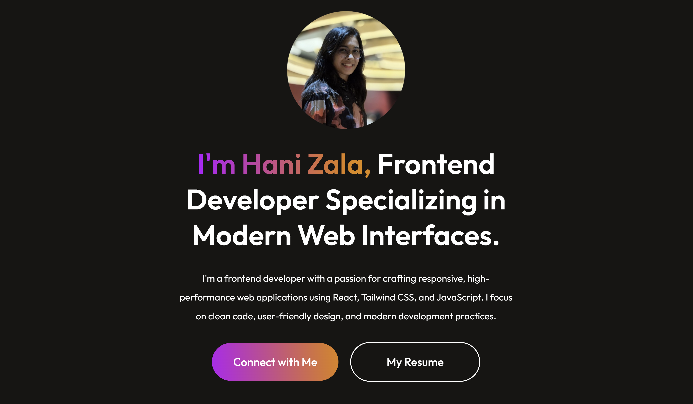

# 💼 Hani Zala - Developer Portfolio

Welcome to my personal portfolio website! This is a fully responsive and modern website that showcases my skills, projects, and professional background as a frontend developer.

---

## 🌐 Deployment

This project is deployed on:

🔗 Live URL: https://hani-zala-portfolio.vercel.app/

---

## 📖 About

This portfolio is designed to give an overview of who I am, what technologies I work with, and some of the best projects I’ve built. It also provides an easy way to contact me or view my resume.

---

## ✨ Features

- Responsive design for desktop and mobile
- Smooth user experience
- Project showcase with demo and GitHub links
- Contact form integration
- Clean and minimal UI/UX

---

## 🛠 Tech Stack

- **Frontend**: React.js, HTML5, CSS3
- **Icons**: React Icons
- **Deployment**: Vercel
- **Backend**: Node.js + Express (for contact form)
- **Database**: MongoDB Atlas

---

## 📸 Screenshots

> 

---

## 🚀 Getting Started

### Prerequisites

- Node.js and npm installed
- Git installed

### Installation

```bash
git clone https://github.com/Hani239/Portfolio
cd portfolio-react
npm install
npm run dev

